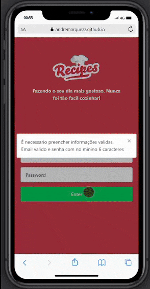
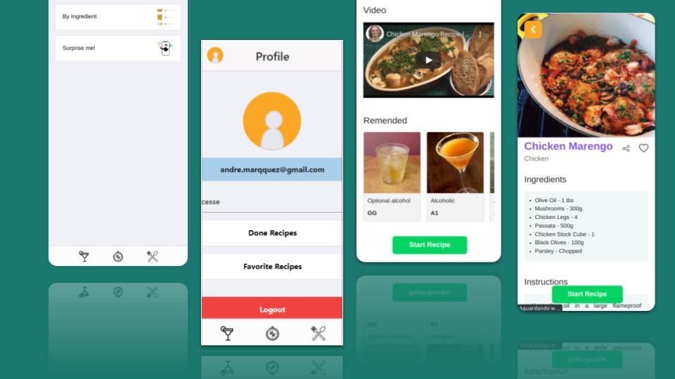

<h1 align="center">App de Receitas</h1>
<p align="center">Aplicativo onde é possivel ver, buscar, filtrar, favoritar e acompanhar o progresso de preparação de receitas e drinks!</p>
<p align="center"> 
  
 </p>

</br>

---

### 💻 Sobre o Projeto

---

<p>Um aplicativo de receitas que tem como base de dados 2 APIs distintas, uma para comidas e outra para bebidas. No aplicativo é possível ver, buscar, filtrar, favoritar e acompanhar o progresso de preparação de receitas e drinks e caso o usuario saia da aplicação é possivel continuar de onde foi pausada.</p>

## APIs

### TheMealDB API

O [TheMealDB](https://www.themealdb.com/) é um banco de dados aberto de comidas, mantido pela comunidade, com receitas e ingredientes de todo o mundo.
Os end-points são bastante ricos, você pode [vê-los aqui](https://www.themealdb.com/api.php)

### The CockTailDB API
O [CockTailDB](https://www.themealdb.com/) é um banco de dados aberto de bebidas, mantido pela comunidade, com receitas e ingredientes de todo o mundo.
Os end-points também são bastante ricos, você pode [vê-los aqui](https://www.thecocktaildb.com/api.php)

---

 <details>
    <summary>Imagens do Aplicativo</summary>
    </br>
  <p>Exemplos de telas do Aplicativo.</p>
 <p align="center"> 
  
 </p>
 
  </details>
  
---

  <details>
    <summary>Sobre o Desenvolvimento</summary>
    </br>
  <p>Utilizamos o método Kanban em conjunto com a ferramenta trello e o layout foi construido no figma e tem como foco dispositivos móveis, durante o desenvolvimento foi utilizado a resolução 360 x 640.</p>
<p>Realizamos DMs até a conclusão do projeto no Zoom, para alinhamentos e merge, toda a comunicação assincrona durante o dia de projeto foi feito com a ferramenta Slack</p>
  </details>

---

 </br>

### 🛠 Tecnologias utilizadas no desenvolvimento do projeto

---

- **[React](https://github.com/facebook/react)**

- **[React Router Dom](https://github.com/ReactTraining/react-router/tree/master/packages/react-router-dom)**

- **[Redux Tool Kit](https://redux-toolkit.js.org/)**

- **[Jest](https://github.com/facebook/jest#-delightful-javascript-testing)**

- **[React Testing Library](https://testing-library.com/docs/)**

---

 </br>

# 🚀 Como executar o projeto

---

## Pré-requisitos

Antes de começar, você vai precisar ter instalado em sua máquina as seguintes ferramentas:
[Git](https://git-scm.com), [Node.js](https://nodejs.org/en/).
Além disto é bom ter um editor para trabalhar com o código como [VSCode](https://code.visualstudio.com/)

_1- Clone o repositorio_

```jsx
git clone git@github.com:TonyyCruz/recipes-app-with_RTK.git
```

_2- Instale as dependencias,execute dentro da pasta do projeto._

```jsx
npm install
```

_3- Inicie o projeto,execute dentro da pasta do projeto._

```jsx
npm start
```
*Testes da aplicação* 
```jsx 
npm test
```

---

</br>

# 👨‍💻 Contribuidores

Time incrivel, espero trabalhar com eles novamente!

*Diego Santos*, *André Marquez*, *Pedro Reis* e *Gabriel Rodrigues*.
